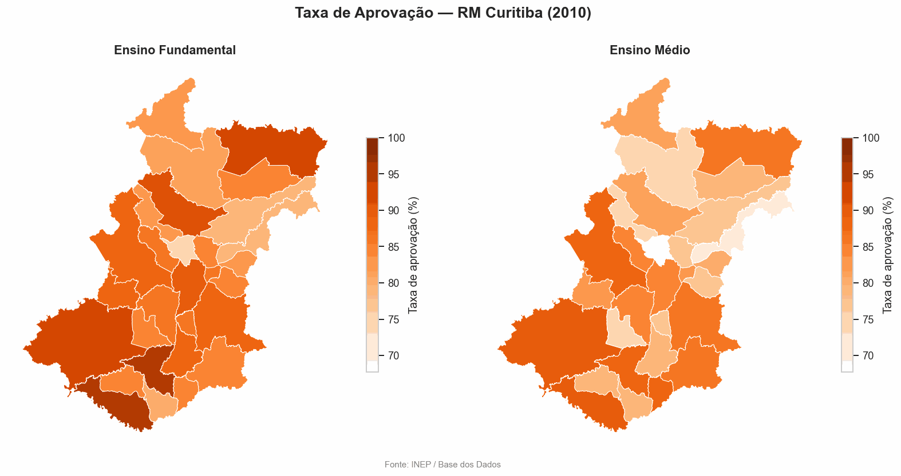
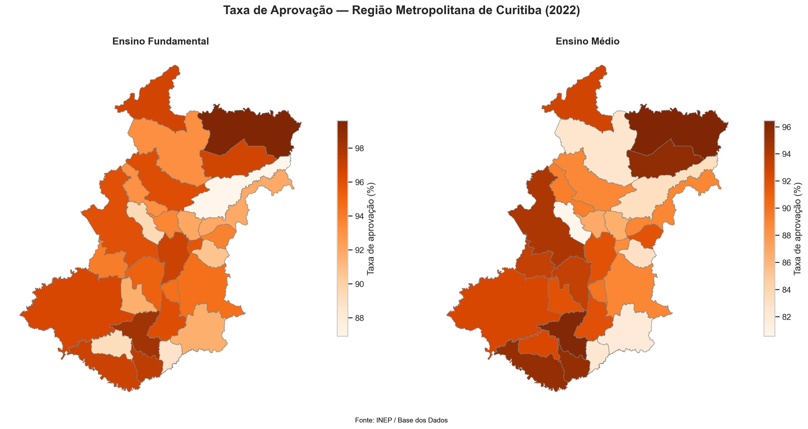
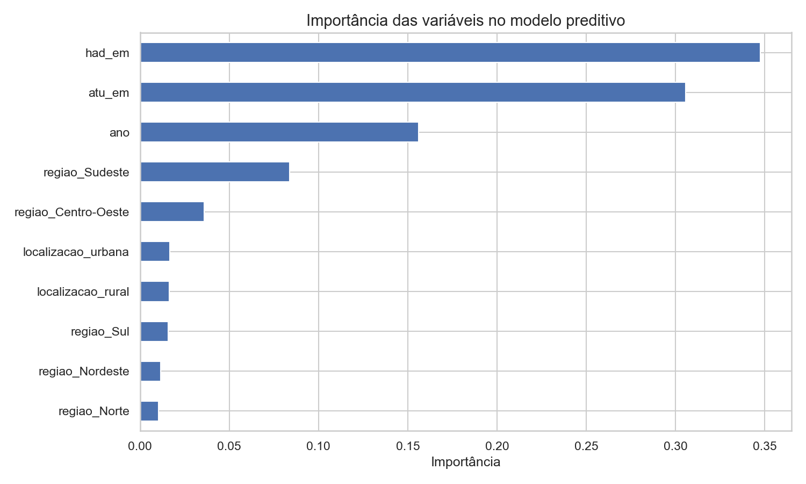

# Desigualdade Educacional Municipal no Brasil (2006–2022)

Análise exploratória, modelo preditivo e mapas geográficos interativos sobre indicadores educacionais municipais brasileiros, com foco na Região Metropolitana de Curitiba.

🗺️ **[Ver mapa interativo (clique aqui)](https://seu-usuario.github.io/indicadores-educacionais-rmc/mapa_interativo.html)**



## Sobre o projeto

Este projeto consulta dados públicos do INEP, disponibilizados pela [Base dos Dados](https://basedosdados.org/), diretamente via SQL no Google BigQuery — sem download manual de CSV. Os dados são tratados em Python (pandas), explorados com visualizações, usados para treinar um modelo preditivo, e por fim mapeados geograficamente com geometrias municipais reais.

**Pergunta de pesquisa:** quais fatores estruturais (alunos por turma, carga horária, localização, região) mais influenciam a taxa de aprovação escolar no Brasil, e como essa realidade varia entre municípios da Região Metropolitana de Curitiba ao longo do tempo?

## Pipeline

1. **Extração** — consulta SQL direta no BigQuery via [`basedosdados`](https://pypi.org/project/basedosdados/), trazendo indicadores educacionais de todos os municípios brasileiros (2006–2022)
2. **Enriquecimento** — junção com dados de UF e mapeamento manual de região (Norte, Nordeste, Sul, Sudeste, Centro-Oeste)
3. **Limpeza** — tratamento de valores nulos, concentrados principalmente no Ensino Médio rural (municípios pequenos frequentemente não oferecem essa etapa)
4. **EDA** — evolução temporal, comparação entre regiões, comparação urbano/rural, correlação entre alunos por turma e aprovação
5. **Modelo preditivo** — Random Forest Regressor prevendo a taxa de aprovação no Ensino Médio a partir de variáveis estruturais
6. **Mapas geográficos** — geometrias municipais reais (polígonos) consultadas via BigQuery, visualizadas como mapa estático, mapa interativo (Plotly + Mapbox) e GIF animado mostrando a evolução ano a ano

## Principais achados

> Preencha esta seção com os números reais depois de rodar o notebook (Run All). Sugestão de estrutura:

- A taxa de aprovação no Ensino Médio variou de **X%** a **Y%** entre 2006 e 2022, com tendência de—
- A região **[nome]** apresentou a maior taxa de abandono no Ensino Médio, enquanto **[nome]** apresentou a menor
- Municípios rurais apresentam taxa de aprovação no EM em média **X pontos percentuais** [maior/menor] que municípios urbanos
- O modelo preditivo (Random Forest) atingiu **MAE de X.X pontos percentuais** e **R² de 0.XX**, com **[variável]** sendo o fator de maior peso na previsão

## Resultados visuais

| Mapa estático (RM Curitiba) | Importância das variáveis |
|---|---|
|  |  |

## Tecnologias utilizadas

Python, pandas, scikit-learn, matplotlib, seaborn, geopandas, Plotly, BigQuery (via `basedosdados`), Pillow.

## Como reproduzir

```bash
git clone https://github.com/seu-usuario/indicadores-educacionais-rmc.git
cd indicadores-educacionais-rmc
pip install -r requirements.txt
```

Abra `notebook/analise_indicadores_educacionais.ipynb`, substitua `billing_id` pelo seu Project ID do Google Cloud (gratuito, [crie aqui](https://console.cloud.google.com/)), e rode todas as células.

## Limitações

Os dados são agregados por município, não por escola ou aluno individual — isso limita a granularidade da análise. Correlação entre variáveis (ex: alunos por turma e aprovação) não implica causalidade. A concentração de valores nulos em municípios pequenos pode introduzir viés nas análises agregadas e no modelo preditivo.

## Próximos passos

Cruzar com dados do IDEB para avaliar correlação entre infraestrutura e desempenho; testar outros modelos (XGBoost, regressão linear como baseline); expandir a análise geográfica para todo o estado do Paraná ou nível nacional.

## Fonte dos dados

[Base dos Dados](https://basedosdados.org/) — Indicadores Educacionais (INEP) e Diretório de Municípios do Brasil.

---

Projeto desenvolvido como parte de portfólio de ciência de dados.
